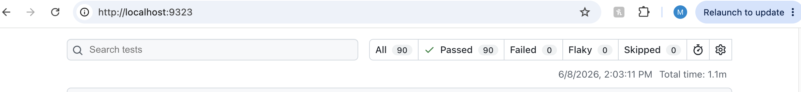

# OmniQA Automation Framework

## Latest Test Execution Results

✅ Cross-Browser Validation Complete

- Chromium: 45 Passed
- Firefox: 45 Passed
- Total: 90 Passed
- Execution Time: 1.1 Minutes

OmniQA is a Playwright-based automation framework that I strategically built on a custom travel web application. I designed and developed this site specifically to enable real-world QA testing scenarios, including Smoke, Negative, Payments, Promo Codes, Business Risk, Show Stopper, and API testing. Unlike generic public websites, every detail of this application was built to give precise control over business logic, validations, and risk conditions for thorough testing.

In the very rare case that the test website is unavailable, you can contact me directly at MichaelMartinezQA@gmail.com or via LinkedIn direct message, and I will assist with verifying or restarting the server.