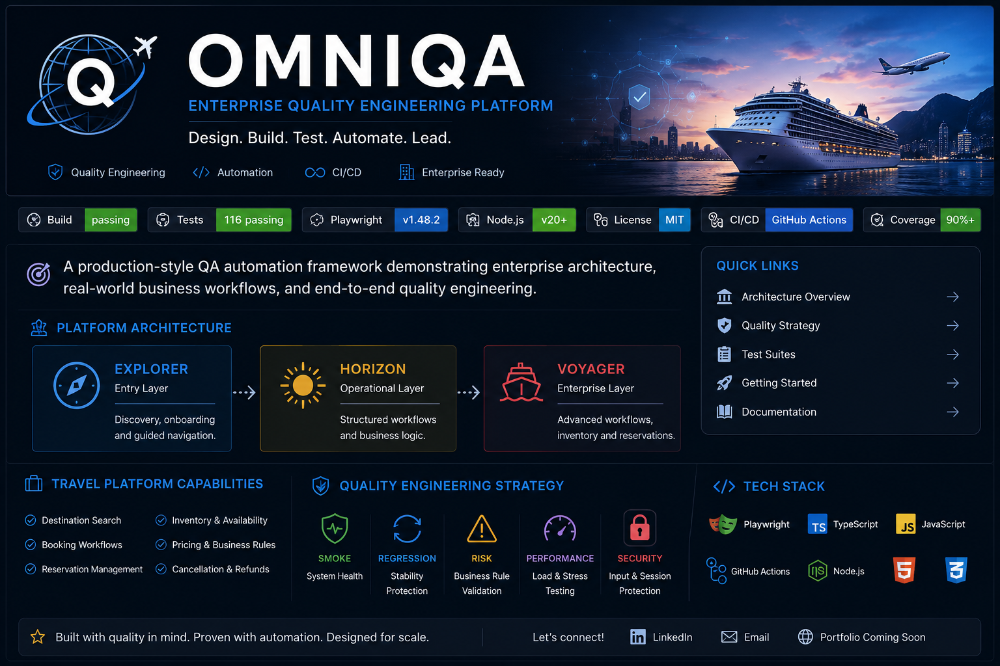

# OmniQA Automation Framework



[](https://github.com/MichaelMartinezQA/OmniQA-Automation-Framework/actions/workflows/playwright.yml)


OmniQA is a production-inspired quality engineering portfolio built around Playwright, TypeScript/JavaScript, API and database validation, and disciplined regression design. It demonstrates how complex, stateful user journeys can be translated from requirements into deterministic automation and cross-browser certification.

This public repository presents the engineering methods, measurable outcomes, and portfolio-safe examples. Proprietary product logic and implementation details remain private.

## What OmniQA Demonstrates

- Enterprise end-to-end automation across layered UI and service workflows
- Stateful workflow testing with explicit ownership of preserved and invalidated data
- Keyboard-driven interaction, focus, lifecycle, boundary, and negative testing
- Deterministic synchronization based on semantic action-readiness
- Chromium and Firefox certification with browser-specific failure analysis
- Regression isolation, repeatability gates, and failure-first debugging
- Requirements-to-test traceability and evidence-based certification
- Git/GitHub workflow discipline with intentional private/public source governance

## Latest Enterprise Certification

| Result | Count |
| --- | ---: |
| Scheduled executions | **226** |
| Passed | **214** |
| Intentional future-scope placeholders | **12** |
| Failed | **0** |
| Unexpected did-not-run | **0** |

**Browsers:** Chromium + Firefox

**Workers:** 2

The certification covers Destination and Travel Date workflows, complex Traveler journeys, large-family scenarios, state-aware editing, independent-data preservation, dependent-state integrity, chronological child-data handling, progressive keyboard interaction, lifecycle/reset validation, and cross-browser action readiness.

[Read the sanitized certification record](docs/certification/enterprise-destination-traveler-milestone.md).

## Engineering Challenges Solved

### Cross-browser interaction stability

An element being visible does not always mean it is ready for the next real user action. OmniQA automation waits for meaningful conditions—such as enabled state, stable focus ownership, completed transitions, and available hit targets—instead of masking instability with arbitrary sleeps or inflated timeouts.

### Complex stateful Traveler workflows

Traveler automation exercises large data sets, repeated edits, keyboard rollback, chronological child-data presentation, and lifecycle transitions. Assertions verify both the intended visible outcome and the integrity of related state after every meaningful change.

### Edit-state preservation

Editing one completed field must not silently erase unrelated completed information. Tests capture independent state before an edit, perform the user action, and verify that only explicitly dependent data changes.

### Dependent-state integrity

When an upstream value changes, automation verifies that invalid dependent data is removed while independent data remains intact. This prevents stale state from surviving into later workflow stages.

### Deterministic data handling

Large-family and child-data scenarios validate stable ordering, repeatable normalization, boundary behavior, and consistent outcomes across browsers without exposing proprietary product rules.

## Automation Methodology

```text
Requirement
    → Risk-based Test Design
    → Deterministic Automation
    → Targeted Stability Validation
    → Cross-Browser Certification
    → Regression Protection
```

Each requirement is connected to observable behavior, automation evidence, and a certification result. Failures are investigated at the owning layer before any fix is applied.

[Explore the sanitized Enterprise automation methodology](docs/methodology/enterprise-automation-methodology.md).

## Failure Classification

OmniQA does not treat every red test as an application bug.

| Classification | Engineering response |
| --- | --- |
| Application defect | Correct the product behavior and add regression protection. |
| Test harness defect | Repair synchronization, interaction, data setup, or assertion ownership. |
| Environment/browser failure | Validate launch and infrastructure independently before evaluating the application. |
| Expected business behavior | Preserve the behavior and clarify the test expectation or requirement. |
| Regression | Identify the owning change, restore the certified contract, and protect the scenario. |

This approach avoids patching the wrong layer and keeps automation trustworthy.

## Technical Skills Demonstrated

| Area | Evidence |
| --- | --- |
| Automation | Playwright, TypeScript/JavaScript, page interaction, fixtures, assertions, regression suites |
| Cross-browser | Chromium and Firefox actionability, focus, keyboard, and lifecycle validation |
| Test architecture | Layered smoke, regression, boundary, negative, security, performance, and accessibility coverage |
| Stateful testing | Edit preservation, dependency invalidation, reset behavior, and progressive workflows |
| Reliability | Semantic waits, deterministic data, repeated stability validation, and failure isolation |
| Quality governance | Traceability, certification gates, defect classification, and regression ownership |
| Engineering workflow | Git, GitHub Actions, CI/CD, private/public source separation, and publication safety |

## Current Progress

OmniQA has evolved through several legitimate portfolio stages:

1. Foundational Playwright automation and layered QA suites
2. API, database, CI/CD, security, performance, and accessibility validation
3. Production-inspired Travel workflows and broader regression protection
4. Stateful Enterprise workflow automation with stronger lifecycle ownership
5. Current Chromium + Firefox certification with 226 scheduled executions and zero failures

The current phase emphasizes richer stateful journeys, cross-browser stability, repeatability gates, requirements traceability, and disciplined root-cause classification.

## Portfolio Documentation

- [Enterprise certification milestone](docs/certification/enterprise-destination-traveler-milestone.md)
- [Enterprise automation methodology](docs/methodology/enterprise-automation-methodology.md)
- [Architecture overview](docs/OMNIQA_ARCHITECTURE.md)
- [Quality strategy](docs/OMNIQA_QUALITY_STRATEGY.md)
- [Engineering standards](docs/OMNIQA_ENGINEERING_STANDARDS.md)
- [Project roadmap](docs/OMNIQA_ROADMAP.md)

## Intellectual Property Boundary

This repository intentionally provides enough evidence to evaluate the engineering: measurable certification results, methodology, generalized examples, quality gates, and project progression.

Detailed business rules, proprietary algorithms, internal contracts, selectors, state-machine implementation, dependency matrices, and confidential architecture are maintained outside the public portfolio. This boundary protects the invention without hiding the engineering discipline used to build and validate it.
