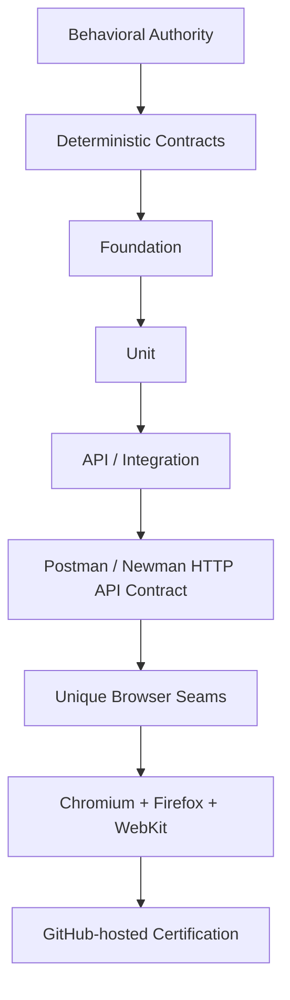

# OmniQA

OmniQA is an enterprise quality-engineering and certification platform built to produce deterministic, traceable evidence across application layers and real browser seams.

## OmniQA CI v1.2 — Certified on Main

OmniQA is certified through a sequential GitHub-hosted Quality Engineering pipeline spanning deterministic lower-level validation, real-HTTP API contract testing, and mandatory Chromium, Firefox, and WebKit certification. The portfolio is continuously validated through automated content and integrity checks.

**Current authoritative certification:** `OmniQA Full CI/CD — Postman API Contract + 3-Browser Certification` · GitHub Actions run `33589158901` · 14m 33s · 100% green

| Certification layer | Certified result |
| ------------------- | ---------------: |
| Lint | Pass |
| Typecheck | Pass — 0 errors |
| Runtime validation | Pass |
| Foundation | 782 / 782 |
| Full Unit | 888 / 888 |
| API / Integration | 11 / 11 |
| Postman / Newman HTTP API Contract | 46 / 46 requests · 51 / 51 assertions |
| Chromium | 72 / 72 |
| Firefox | 72 / 72 |
| WebKit | 72 / 72 |
| Browser total | 216 / 216 |
| Retries | 0 |
| Arbitrary waits | 0 |

## Test Pyramid by Architectural Maturity

OmniQA's Test Pyramid transition reflects engineering maturity. Approximately 90% of the relevant core engine behavior has reached sufficient behavioral specification maturity to support deterministic testing closer to its owning layer.

The approximately 90% figure represents behavioral specification maturity across the relevant core engines—the point at which those behaviors became sufficiently defined for deterministic validation closer to their owning layers.

OmniQA’s Test Pyramid evolved alongside the application. As engines and behavioral contracts matured, deterministic validation moved closer to the layers that own those behaviors. Real-HTTP contract testing now complements controlled API/Integration validation, while browser E2E remains focused on genuine browser seams.

Deterministic layers own repeatable state, calculation, transition, and boundary evidence. Vitest API/Integration provides controlled integration validation. Postman/Newman adds real HTTP validation against the running OmniQA service. Playwright browser certification remains focused on behavior that genuinely requires a rendering engine, including interaction, accessibility, focus, event ordering, and viewport behavior.

## Capabilities and Technology

- Deterministic Foundation and Unit validation
- Controlled API and integration validation
- Real-HTTP contract validation with Postman and Newman
- Cross-browser certification with Playwright
- Accessibility validation with axe-core
- Strict TypeScript and ESLint gates
- Runtime validation and GitHub Actions governance
- Governed engineering, certification, and portfolio practices

**Technology:** Playwright · TypeScript · JavaScript · Vitest · Postman · Newman · ESLint · Node.js · Express · SQLite · axe-core · GitHub Actions

## Quality Engineering Examples

This repository includes practical examples demonstrating Playwright, TypeScript, API validation, accessibility, negative testing, and Quality Engineering structure. Together they illustrate the testing techniques and architectural principles used throughout OmniQA’s engineering evolution.

## Documentation

- [CI v1.2 full Quality Engineering certification showcase](docs/OmniQA_CI_v1.2_Showcase.md)
- [OmniQA Quality Engineering methodology](docs/methodology/enterprise-automation-methodology.md)

## Engineering Portfolio

This portfolio presents OmniQA’s Quality Engineering architecture, methodology, certification evidence, and selected implementation examples. It is designed to demonstrate the engineering decisions, testing strategy, and deterministic principles behind the platform’s evolution.
