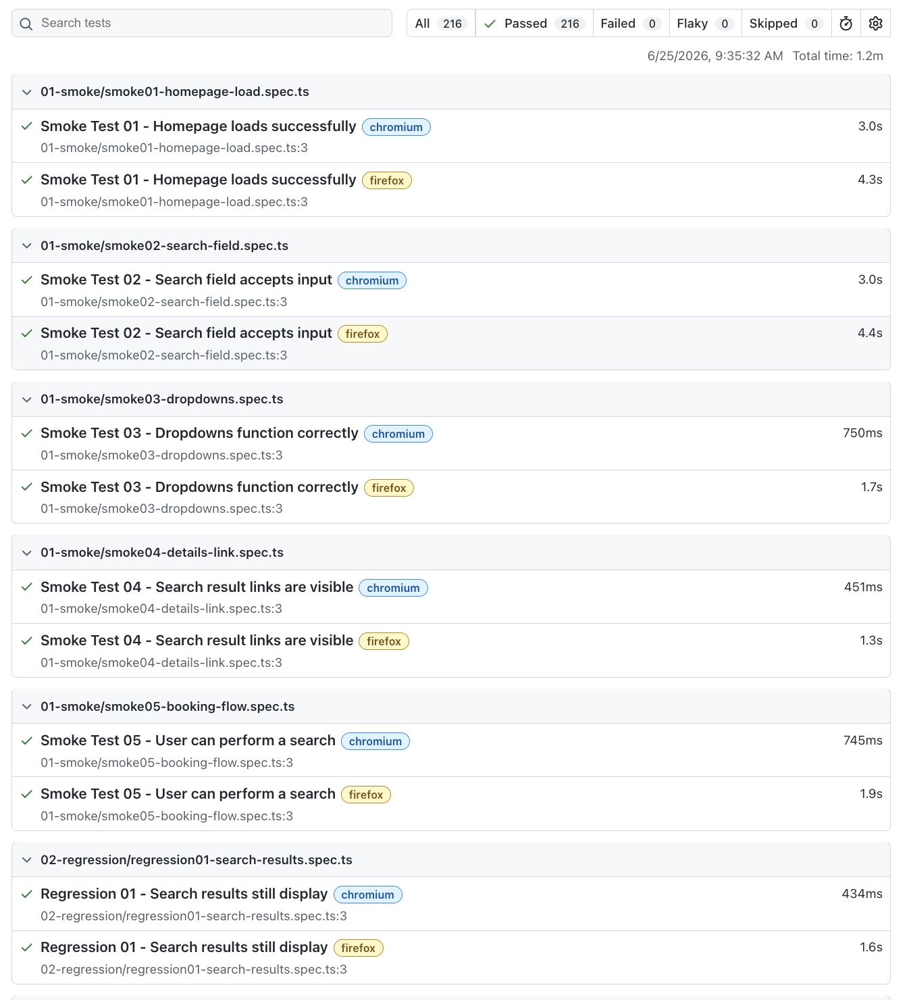

# OmniQA Automation Framework

## QA Leadership + Modern Test Automation Portfolio

**Michael Martinez**
Quality Assurance Director | QA Leader | Automation Engineer

15+ years of Quality Assurance experience across Hospitality, Travel, Telecommunications, Customer Experience, Business Risk Analysis, and Software Quality Assurance.

This repository demonstrates both QA leadership and hands-on technical execution through the design and development of a production-style automation framework built using Playwright, TypeScript, Node.js, SQLite, Express.js, GitHub Actions, and CI/CD automation.

---

# Latest Official Regression Results

✅ 216 Passed

✅ 0 Failed

✅ Chromium: 108 Passed

✅ Firefox: 108 Passed

✅ Execution Time: 1.4 Minutes



---

# Executive Summary

OmniQA is a production-style Quality Assurance Automation Framework designed to simulate real-world travel and hospitality reservation systems.

The framework demonstrates:

* Test Automation
* Quality Engineering
* Risk Assessment
* Release Management
* Defect Triage
* Inventory Management
* API Validation
* Business Critical Testing
* Cross-Browser Automation
* CI/CD Integration
* Test Data Management

The project was intentionally designed to showcase how QA leadership principles translate into scalable automation solutions.

---

# Technology Stack

* Playwright
* TypeScript
* Node.js
* SQLite
* Express.js
* Git
* GitHub
* GitHub Actions
* CI/CD Automation

---

# Current Project Metrics

## Automated Testing Coverage

```text
108 Automated Test Scenarios

108 Chromium Passed
108 Firefox Passed

216 Cross-Browser Executions
0 Failed
```

## Production Database Coverage

```text
1300 Hotel Rooms
177 Cruise Sailings
177,000 Cruise Staterooms

Reservations Table
Audit Log Table
```

---

# Test Suite Organization

## 01 - Smoke Testing

5 Automated Tests

Coverage:

* Homepage Availability
* Search Functionality
* Navigation
* Booking Access
* Core User Flows

---

## 02 - Regression Testing

5 Automated Tests

Coverage:

* Existing Functionality
* Search Results
* Booking Flows
* Form Submission
* Navigation Validation

---

## 03 - Negative Testing

6 Automated Tests

Coverage:

* Invalid Inputs
* Missing Data
* Invalid Email Formats
* Missing Travel Dates
* Missing Payment Data
* Defensive Validation

---

## 04 - Payments Testing

6 Automated Tests

Coverage:

* Successful Payments
* Declined Cards
* Expired Cards
* Invalid CVV
* Payment Timeouts
* Card Length Validation

---

## 05 - Promo Code Testing

5 Automated Tests

Coverage:

* Valid Promo Codes
* Expired Promo Codes
* Reused Promo Codes
* Invalid Promo Codes
* Empty Promo Codes

---

## 06 - API Testing

6 Automated Tests

Coverage:

* Status Code Validation
* Response Time Validation
* Response Schema Validation
* Invalid Requests
* Authentication Validation
* Sold-Out Inventory APIs

---

## 07 - Show Stopper Testing

5 Automated Tests

Coverage:

* Booking Failures
* Search Failures
* Payment Failures
* Date Validation
* Critical User Journeys

---

## 08 - Business Risk Testing

5 Automated Tests

Coverage:

* Duplicate Booking Prevention
* Past Date Prevention
* Inventory Validation
* Pricing Risk Validation
* Booking Confirmation Validation

---

## 09 - Reservation Management

15 Automated Tests

Coverage:

* Refundable Reservations
* Non-Refundable Reservations
* Reservation Modifications
* Modification Restrictions
* Cancellation Rules
* Hold Management
* Inventory Reduction
* Inventory Restoration
* Seasonal Pricing
* Sold-Out Validation

---

## 10 - Backend API Testing

20 Automated Tests

Coverage:

* Inventory Retrieval
* Inventory Reduction
* Inventory Restoration
* Sold-Out Validation
* Double Cancellation Prevention
* Request Validation
* Invalid Requests
* Stateroom Inventory Management
* Inventory Boundary Protection
* Multi-Booking Consistency

---

## 11 - Release Management

10 Automated Tests

Coverage:

* Critical Defect Validation
* Payment Failure Risk
* API Outage Risk
* Revenue Impact Analysis
* Smoke Suite Requirements
* Production Readiness Validation
* Final Release Approval Logic

---

## 12 - Defect Triage & Risk Assessment

10 Automated Tests

Coverage:

* Critical Production Defects
* High Severity Defects
* Workaround Analysis
* Security Risks
* Compliance Risks
* VIP Customer Impact
* Executive Risk Reviews

---

## 13 - Test Data Management

10 Automated Tests

Coverage:

* Test Data Reset
* Test Data Seeding
* Cleanup Processes
* Duplicate Prevention
* Bulk Data Generation
* Environment Isolation
* Production Data Protection
* Audit Trail Validation

---

# Production Database Integration

OmniQA includes a SQLite-backed production-style inventory system.

## Database Objects

### Hotel Inventory

```text
1300 Hotel Rooms
```

### Cruise Inventory

```text
177 Cruise Sailings
177,000 Cruise Staterooms
```

### Reservation Tracking

Coverage Includes:

* Reservations
* Inventory Allocation
* Inventory Restoration
* Audit Logging
* Availability Validation

---

# Inventory Management System

OmniQA validates inventory behavior for multiple travel products.

### Room Inventory

```text
Maximum Inventory: 5
```

### Stateroom Inventory

```text
Maximum Inventory: 3
```

Coverage Includes:

* Inventory Reduction
* Inventory Restoration
* Sold-Out Detection
* Reservation Blocking
* Inventory Boundary Validation

---

# Production APIs

## Inventory Summary API

Returns:

* Hotel Room Counts
* Cruise Sailing Counts
* Cruise Stateroom Counts
* Reservation Counts
* Audit Log Counts

## Hotel Inventory API

Returns:

* Available Rooms
* Room Metadata
* Destination Inventory

## Cruise Inventory API

Returns:

* Sailing Schedules
* Destinations
* Availability Data

---

# Official Sold-Out Inventory Period

Dedicated business-risk validation period:

```text
July 13, 2027
through
July 20, 2027
```

Coverage Includes:

* Sold-Out Inventory Validation
* Reservation Blocking
* Inventory Management
* Business Risk Analysis
* Reservation Lifecycle Testing

---

# Cross-Browser Validation

Validated Browsers:

✅ Chromium

✅ Firefox

Results:

```text
108 Chromium Passed
108 Firefox Passed

216 Passed
0 Failed
```

---

# Continuous Integration

GitHub Actions automatically validates framework stability.

Coverage Includes:

* Automated Execution
* Regression Validation
* Cross-Browser Testing
* CI/CD Automation
* Continuous Quality Monitoring

---

# Professional Skills Demonstrated

* Quality Assurance Leadership
* Test Automation
* Playwright Automation
* TypeScript
* API Testing
* CI/CD
* GitHub Actions
* Release Management
* Risk Assessment
* Defect Triage
* Inventory Management
* Test Data Management
* Business Risk Analysis
* Hospitality Technology
* Travel Technology
* Cross-Browser Testing
* Quality Engineering

---

# About the Author

## Michael Martinez

Quality Assurance Director with 15+ years of experience leading quality initiatives across:

* Hospitality
* Travel
* Telecommunications
* Customer Experience
* Software Quality Assurance
* Business Risk Analysis

Career highlights include:

* Building QA organizations from the ground up
* Driving quality strategy and operational excellence
* Improving sales performance through quality programs
* Leading cross-functional quality initiatives
* Implementing automation frameworks and testing strategies
* Managing business-critical risk and release decisions

GitHub:

MichaelMartinezQA

---

If the OmniQA application or supporting environment is unavailable, please contact me through GitHub or LinkedIn and I will gladly assist with verification.
