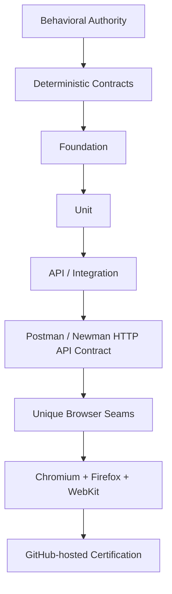

# OmniQA

OmniQA is an enterprise quality-engineering and certification platform built to produce deterministic, traceable evidence across application layers and real browser seams.

## OmniQA CI v1.1 — Certified on Main

The current private OmniQA system is certified through a sequential GitHub-hosted pipeline with mandatory Chromium, Firefox, and WebKit gates. This public repository is checked separately by **Public Portfolio Validation**, which validates Markdown, local links, Mermaid syntax, SVG/assets, public-content boundaries, and secret exposure. It does not certify or reproduce OmniQA CI v1.1.

| Certification layer | Certified result |
| ------------------- | ---------------: |
| Lint | Pass |
| Typecheck | Pass — 0 errors |
| Runtime validation | Pass |
| Foundation | 770 / 770 |
| Full Unit | 876 / 876 |
| API / Integration | 11 / 11 |
| Postman / Newman HTTP API Contract | 46 / 46 requests · 51 / 51 assertions |
| Chromium | 71 / 71 |
| Firefox | 71 / 71 |
| WebKit | 71 / 71 |
| Browser total | 213 / 213 |
| Retries | 0 |
| Arbitrary waits | 0 |

## Test Pyramid by Architectural Maturity

OmniQA's Test Pyramid transition reflects engineering maturity. Approximately 90% of the relevant core engine behavior has reached sufficient behavioral specification maturity to support deterministic testing closer to its owning layer.

This figure describes behavioral specification maturity for the relevant core engines. It does **not** mean 90% product completion, production readiness, test coverage, or feature completion.

Today's Test Pyramid could not have been designed on day one because today's engines and behavioral contracts did not yet exist. As OmniQA matured, deterministic behavior became eligible for validation closer to its owning layer, while browser E2E became focused on genuine browser seams. The newest stage adds real-HTTP contract validation without replacing the existing API and integration layer.

Deterministic layers own repeatable state, calculation, transition, and boundary evidence. Vitest API/Integration provides controlled integration validation. Postman/Newman adds real HTTP validation against the running OmniQA service. Playwright browser certification remains focused on behavior that genuinely requires a rendering engine, including interaction, accessibility, focus, event ordering, and viewport behavior.

## Capabilities and Technology

- Deterministic Foundation and Unit validation
- Controlled API and integration validation
- Real-HTTP contract validation with Postman and Newman
- Cross-browser certification with Playwright
- Accessibility validation with axe-core
- Strict TypeScript and ESLint gates
- Runtime validation and GitHub Actions governance
- Public/private source and publication safeguards

**Technology:** Playwright · TypeScript · JavaScript · Vitest · Postman · Newman · ESLint · Node.js · Express · SQLite · axe-core · GitHub Actions

## Curated Public Examples

This repository retains selected conventional examples that demonstrate Playwright, TypeScript, API validation, accessibility, negative testing, and quality-engineering structure. They are portfolio examples—not the private OmniQA product, its proprietary engines, or its authoritative certification suites.

## Documentation

- [CI v1.1 three-browser certification showcase](docs/OmniQA_CI_v1.1_Showcase.md)
- [Public-safe quality-engineering methodology](docs/methodology/enterprise-automation-methodology.md)

## Private Intellectual-Property Boundary

The public portfolio intentionally excludes private application source, Business Rules, engine contracts, User Stories and Journeys, specifications, tests, audits, algorithms, internal implementation details, repository history, and operational credentials.

Public material describes architecture and achievements only at a high level. The certified private system remains separate from these curated examples.
