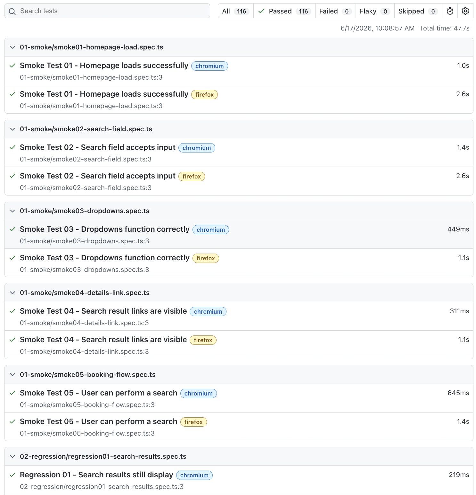

# OmniQA Automation Framework

## Latest Official Regression Results

✅ 116 Passed

✅ 0 Failed

✅ Chromium: 58 Passed

✅ Firefox: 58 Passed

✅ Execution Time: 47.7 Seconds



---

## Overview

OmniQA is a Playwright-based automation framework built on a custom travel reservation application designed specifically for quality assurance training, portfolio development, and real-world business risk testing.

The application and test suites were intentionally designed to simulate production-style travel booking workflows, including:

- Travel Reservations
- Inventory Management
- Payment Processing
- Reservation Modifications
- Cancellation Workflows
- Promo Code Validation
- Sold-Out Inventory Scenarios
- Seasonal Pricing
- Business Risk Validation
- API Testing

This project demonstrates QA leadership, risk analysis, automation strategy, test design, and Playwright automation development using TypeScript.

---

## Technology Stack

- Playwright
- TypeScript
- Node.js
- Git
- GitHub
- GitHub Actions (CI/CD)

---

## Project Evolution

### Phase 1

40 Automated Tests

Core Smoke, Regression, Negative, Payments, Promo Code, Business Risk, Show Stopper, and API coverage.

### Phase 2

90 Cross-Browser Tests

Expanded Chromium and Firefox execution.

### Phase 3

106 Automated Tests

Added Reservation Management workflows.

### Phase 4

116 Automated Tests

Added:

- Inventory Management
- Inventory Restoration
- Sold-Out Inventory Validation
- Stateroom Inventory Tracking
- Seasonal Pricing Validation
- Reservation Lifecycle Coverage

---

## Test Suites

### 01 - Smoke Testing

Core application availability and functionality validation.

### 02 - Regression Testing

Regression coverage for previously validated functionality.

### 03 - Negative Testing

Validation of invalid inputs, error handling, and defensive controls.

### 04 - Payments Testing

Coverage includes:

- Valid Payments
- Declined Cards
- Expired Cards
- Invalid CVV
- Payment Timeouts
- Card Length Validation

### 05 - Promo Code Testing

Coverage includes:

- Valid Promo Codes
- Expired Promo Codes
- Previously Used Promo Codes
- Invalid Promo Codes
- Empty Promo Codes
- Stacking Prevention

### 06 - API Testing

Coverage includes:

- Status Code Validation
- Response Time Validation
- Response Schema Validation
- Invalid Request Handling
- Authentication Validation
- Sold-Out Inventory API Validation

### 07 - Show Stopper Testing

Critical failures capable of preventing bookings or disrupting core business workflows.

### 08 - Business Risk Testing

Coverage includes:

- Duplicate Booking Prevention
- Past Date Prevention
- Price Change Detection
- Inventory Validation
- Booking Confirmation Validation

### 09 - Reservation Management

Comprehensive reservation lifecycle coverage:

- Refundable Reservations
- Non-Refundable Reservations
- Reservation Modifications
- Modification Restrictions
- Cancellation Rules
- Cancellation Holds
- Inventory Reduction
- Inventory Restoration
- Sold-Out Validation
- Seasonal Pricing Validation

---

## Inventory Management

The OmniQA application includes inventory tracking for multiple travel products.

### Room Inventory

Starting Inventory:

```text
5
```

### Stateroom Inventory

Starting Inventory:

```text
3
```

Coverage Includes:

- Inventory Reduction
- Inventory Restoration
- Sold-Out Detection
- Reservation Blocking
- Inventory Validation

---

## Official Sold-Out Inventory Period

The framework includes a dedicated sold-out inventory period for automated testing:

### July 13, 2027 through July 20, 2027

This date range is intentionally configured for:

- Sold-Out Inventory Validation
- Reservation Blocking
- Inventory Management Testing
- Business Risk Testing
- Reservation Management Testing

---

## Cross-Browser Validation

The complete suite executes successfully in:

✅ Chromium

✅ Firefox

Current Results:

```text
58 Chromium Passed
58 Firefox Passed

116 Passed
0 Failed
```

---

## Continuous Integration

GitHub Actions automatically executes the OmniQA test suite and validates framework stability through continuous integration workflows.

---

## About the Author

### Michael Martinez

Quality Assurance Director with 15+ years of experience across:

- Hospitality
- Travel
- Telecommunications
- Customer Experience
- Software Quality Assurance
- Business Risk Analysis

This repository was created to demonstrate practical QA leadership, automation strategy, business-risk thinking, and Playwright automation development.

GitHub:

MichaelMartinezQA

---

In the rare event that the OmniQA test application is unavailable, please contact me through GitHub or LinkedIn and I will gladly assist with verification.