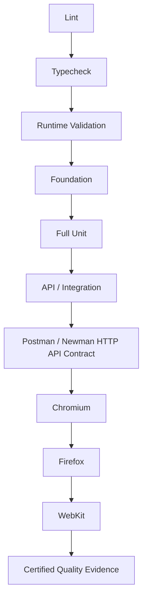

# OmniQA CI v1.1 — Three-Browser Certification

OmniQA's Test Pyramid transition reflects engineering maturity. Approximately 90% of the relevant core engine behavior had reached sufficient behavioral specification maturity to support deterministic testing closer to its owning layer. This does not mean 90% product completion, production readiness, test coverage, or feature completion.

Today's Test Pyramid could not have been designed on day one because today's engines and behavioral contracts did not yet exist. As OmniQA matured, deterministic behavior became eligible for validation closer to its owning layer, while browser E2E became focused on genuine browser seams.

Vitest API/Integration remains the controlled integration layer. Postman/Newman now adds a distinct real-HTTP contract layer against the running OmniQA service; it does not replace the existing integration tests. The complete pipeline then certifies genuine browser behavior on GitHub-hosted Chromium, Firefox, and WebKit.

This certification describes the private OmniQA system. The conventional examples and sample workflow in this public repository are intentionally separate and are not presented as the certified private pipeline.

**Authoritative certification run**

- Run name: `OmniQA Full CI/CD Certification — 3 Browsers + API Contract`
- GitHub Actions run: `33574481590`
- Total duration: 17m 30s
- Conclusion: 100% green

| Certification layer | Certified result |
| ------------------- | ---------------: |
| Lint | Pass |
| Typecheck | Pass — 0 errors |
| Runtime validation | Pass |
| Foundation | 770 / 770 |
| Full Unit | 876 / 876 |
| API / Integration | 11 / 11 |
| Postman / Newman HTTP API Contract | 46 / 46 requests · 51 / 51 assertions |
| Chromium | 71 / 71 |
| Firefox | 71 / 71 |
| WebKit | 71 / 71 |
| Browser total | 213 / 213 |
| Retries | 0 |
| Arbitrary waits | 0 |

This milestone demonstrates a deterministic, sequential quality gate with complete three-browser certification and no retry-based or time-based masking. Private application code, specifications, tests, audits, and implementation details remain outside this public portfolio.
