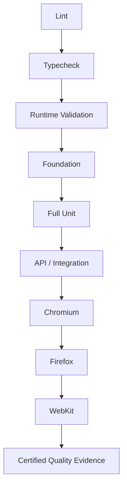

# OmniQA CI v1.1 — Three-Browser Certification

OmniQA's Test Pyramid transition reflects engineering maturity. Approximately 90% of the relevant core engine behavior had reached sufficient behavioral specification maturity to support deterministic testing closer to its owning layer. This does not mean 90% product completion, production readiness, test coverage, or feature completion.

Deterministic validation now supports focused browser certification for behavior that genuinely depends on a browser. The complete pipeline runs on GitHub-hosted infrastructure with Chromium, Firefox, and WebKit as mandatory gates.

| Certification layer | Certified result |
| ------------------- | ---------------: |
| Lint | Pass |
| Typecheck | Pass — 0 errors |
| Runtime validation | Pass |
| Foundation | 716 / 716 |
| Full Unit | 716 / 716 |
| API / Integration | 11 / 11 |
| Chromium | 71 / 71 |
| Firefox | 71 / 71 |
| WebKit | 71 / 71 |
| Browser total | 213 / 213 |
| Retries | 0 |
| Arbitrary waits | 0 |

This milestone demonstrates a deterministic, sequential quality gate with complete three-browser certification and no retry-based or time-based masking. Private application code, specifications, tests, audits, and implementation details remain outside this public portfolio.
