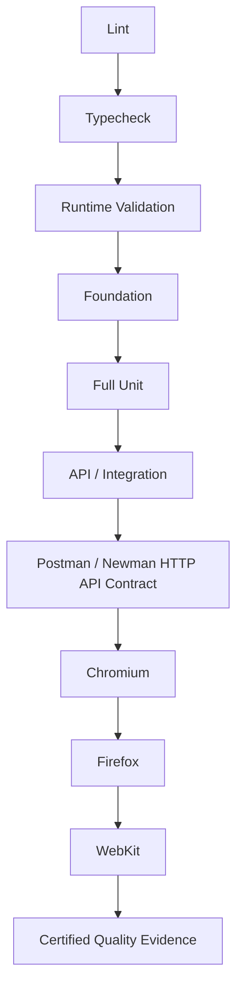

# OmniQA CI v1.2 — Full Quality Engineering Certification

OmniQA's Test Pyramid transition reflects engineering maturity. The approximately 90% figure represents behavioral specification maturity across the relevant core engines—the point at which those behaviors became sufficiently defined for deterministic validation closer to their owning layers.

OmniQA’s Test Pyramid reflects the platform’s engineering maturity. As engines and behavioral contracts became more sophisticated, the testing architecture evolved alongside them—expanding deterministic validation at the appropriate layers while sharpening browser certification around genuine browser behavior.

Vitest API/Integration and Postman/Newman provide complementary validation layers: controlled integration evidence followed by real-HTTP contract validation against the running OmniQA service. The complete pipeline then certifies genuine browser behavior on GitHub-hosted Chromium, Firefox, and WebKit.

The certification metrics represent OmniQA’s complete governed Quality Engineering pipeline. The portfolio examples demonstrate selected techniques and architectural patterns that support that broader engineering approach.

**Authoritative certification run**

- Run name: `OmniQA Full CI/CD Certification — 3 Browsers + API Contract`
- GitHub Actions run: `33574481590`
- Total duration: 17m 30s
- Conclusion: 100% green

| Certification layer | Certified result |
| ------------------- | ---------------: |
| Lint | Pass |
| Typecheck | Pass — 0 errors |
| Runtime validation | Pass |
| Foundation | 770 / 770 |
| Full Unit | 876 / 876 |
| API / Integration | 11 / 11 |
| Postman / Newman HTTP API Contract | 46 / 46 requests · 51 / 51 assertions |
| Chromium | 71 / 71 |
| Firefox | 71 / 71 |
| WebKit | 71 / 71 |
| Browser total | 213 / 213 |
| Retries | 0 |
| Arbitrary waits | 0 |

This milestone demonstrates a deterministic, sequential quality gate with complete three-browser certification and no retry-based or time-based masking.
